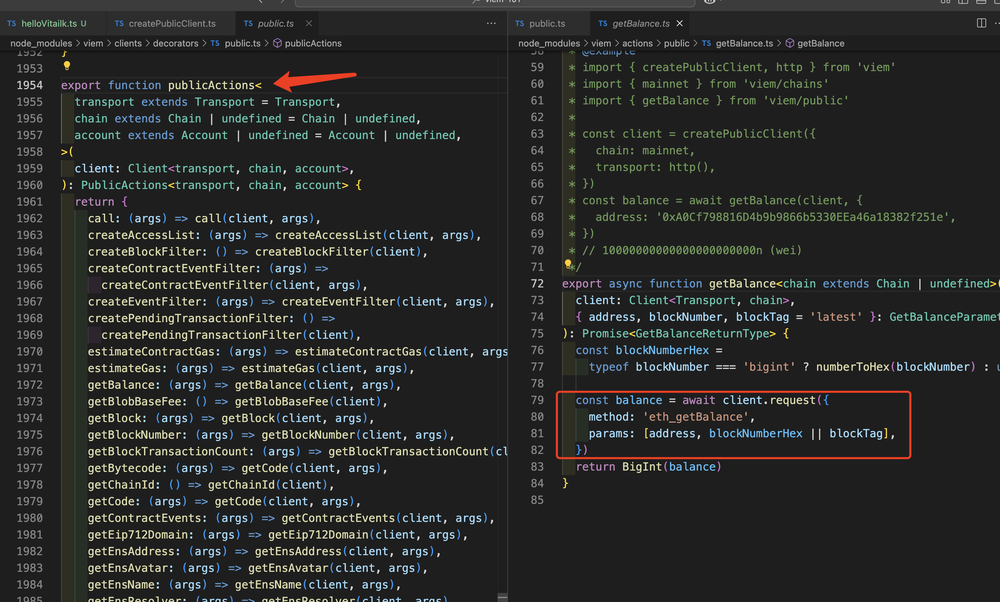

# 基础

环境问题就按照 WTF 这里的去配置就好。

[https://github.com/WTFAcademy/WTF-Ethers/blob/main/01_HelloVitalik/readme.md]

## 首先来说，在 web3 交互需要考虑的问题无非是：

- 传统开发：前端 → API 端点 → 后端 → 数据库
- Web3 开发：前端 → RPC 端点 → 区块链 → 智能合约/状态

其实和传统的前端 axios reactQuery 请求后端 也没什么区别，对吧？

web3 其实也是一样的，不过这个端点被称之为 rpc，同样你只要按照特定的格式用 axios 去向 rpc 发送一个请求，rpc 会在区块链执行特定的程序。最后返回给你 response。

API 端点请求示例：[https://www.quicknode.com/docs/ethereum/eth_accounts]

正常开发中，不可能自己去用 axios 自己封装 rpc 的请求。直接使用 web3 开源库就行啦。
Viem:[https://viem.sh/docs/ethers-migration#jsonrpcprovider]

# 实操

首先创建一个客户端，这个客户端封装了相关的 rpc 方法。ethers 把这个定义为 jsonRpcProvider
这里的 transport 就是节点 rpc url 了，可以理解成后端的 Url

```ts
const publicClient = createPublicClient({
  chain: mainnet,
  transport: http("https://eth-mainnet.public.blastapi.io"),
});
```

发送一个请求

```ts
async function main() {
  const address = await publicClient.getEnsAddress({
    name: "vitalik.eth",
  });

  console.log(address); //0xd8dA6BF26964aF9D7eEd9e03E53415D37aA96045
  const balance = await publicClient.getBalance({
    address: address as Address,
    // address: "0xd8dA6BF26964aF9D7eEd9e03E53415D37aA96045",
  });
  console.log(balance); //157086230675358967n;
}
main().catch((err) => {
  console.error(err);
});
```

## viem 源码，可看可不看

总结就是：使用 fetch 向 rpc 端点发送请求

这里不难看出，这个 action 就是从刚才创建的 client 实例上进行 request，使用特定的 method 传入相应的参数。
我们就会得到相应的 response

```ts
export async function getBalance<chain extends Chain | undefined>(
  client: Client<Transport, chain>,
  { address, blockNumber, blockTag = "latest" }: GetBalanceParameters
): Promise<GetBalanceReturnType> {
  const blockNumberHex =
    typeof blockNumber === "bigint" ? numberToHex(blockNumber) : undefined;

  const balance = await client.request({
    method: "eth_getBalance",
    params: [address, blockNumberHex || blockTag],
  });
  return BigInt(balance);
}
```

其实如果你愿意继续看`transport: http("https://eth-mainnet.public.blastapi.io"),`源码的话，就会更加的清晰

从这里可以看到 http 方法里边是获取了一个 httpclient，继续往下看。

继续看 createPublicClient 用到的 createClient 函数，在这里得到了之前 http 创建的 request，也就可以向 rpc 端点发送 fetch 请求了

最后还是回到上边的 actions 了


第一节到这就完毕啦^\_^
