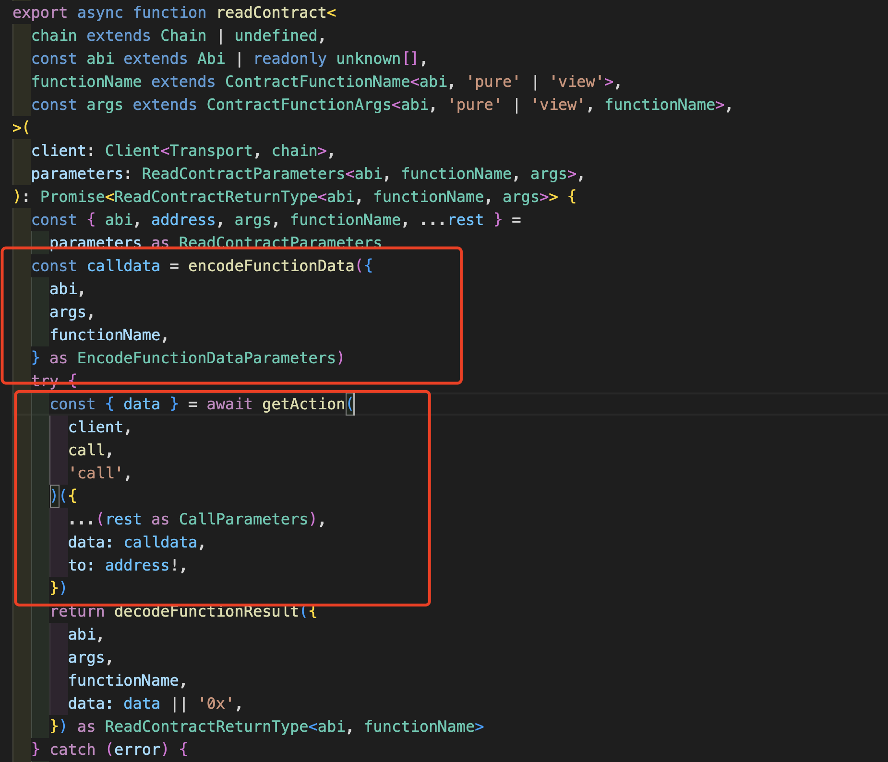
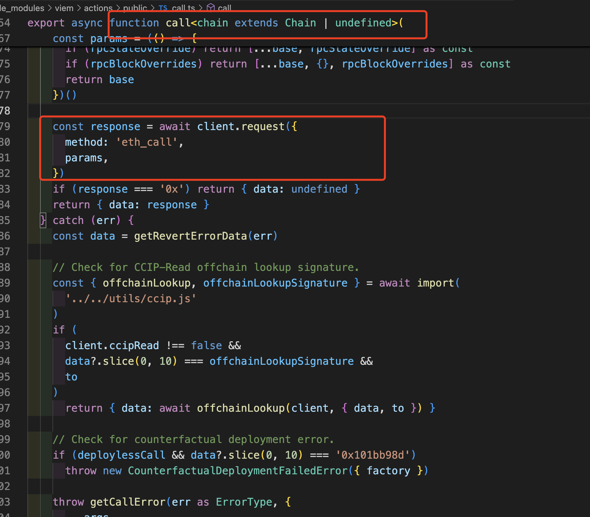

在 viem 中给了两种方式来与合约交互

- 第一种 先获取合约实例 然后与合约交互
- 第二种直接使用 readContract 方法进行合约交互

## Contract 实例

### 解释

要创建出一个 Contract 实例，需要三部分 合约地址 合约 abi Client(也可以理解成 ethers 的 Provider)

合约地址：

Client：在上一章已经说过

合约 ABI：

1.ABI 是合约接口的说明。
2.ABI 定义与合约进行交互数据编码规则。

在我看来 合约的 ABI 和 合约中的 interface 没有什么区别，本质是一个东西。

你可以想象成 ABI 就是智能合约的使用手册，描述了合约的每一个可以交互的函数，并规定了如何交互，具体需要哪些参数，是写函数还是读函数。如果不按照使用手册规定的方式处理，就会报错。

#### ABI 的两种表现形式

```ts
import { erc20Abi, getContract } from "viem";
// 这是erc20Abi中的一部分 完全是json形式 这也是ABI的标准形式，也是Viem要求的形式
{ type: 'function',
    name: 'balanceOf',
    stateMutability: 'view',
    inputs: [
      {
        name: 'account',
        type: 'address',
      },
    ],
    outputs: [
      {
        type: 'uint256',
      },
    ],
  },
```

与下边这个 abiERC20 比较，不难看出上边的 erc20Abi 中的意思就是 一个 name 为 balanceOf 类型是一个函数 可见性是 view，参数 1 是 account 类型是 Address 类型

```ts
const abiERC20 = [
  "function balanceOf(address) view returns (uint)",
  "function name() view returns (string)",
  "function symbol() view returns (string)",
  "function totalSupply() view returns (uint256)",
];
```

### 创建实例-1

在 WTF 学习的这一章可以看到，文章中使用了上述的两种 ABI 形式来创建 Contract 实例，但是 Viem 要求使用标准 ABI json 格式
可以使用 parseAbi 转换为标准格式

```ts
import { erc20Abi, getContract, parseAbi } from "viem";
import { publicClient, walletClient } from "../getClients";
import { MY_ACCOUNT } from "../constants";
// 这是abi的函数签名的定义  这个和solidity中的interface的定义相同
const abiERC20 = parseAbi([
  "function name() view returns (string)",
  "function symbol() view returns (string)",
  "function totalSupply() view returns (uint256)",
  "function balanceOf(address) view returns (uint)",
]);
// 创建只读合约实例
const contract = getContract({
  client: publicClient,
  address: "0xc02aaa39b223fe8d0a0e5c4f27ead9083c756cc2",
  abi: erc20Abi, //abiERC20, //erc20Abi,
});
```

**调用读方法**
这里的调用就是与 ethers 不同的地方，ethers 是直接传入参数 balanceOf(address)
viem 选择作为数组传递 对应函数的多个参数

```ts
合约函数：
function balanceOf(address account) external view returns (uint256);
function allowance(address owner, address spender) external view returns (uint256);
// viem 调用 - 数组元素按顺序对应
await contract.read.balanceOf([account]);
await contract.read.allowance([owner, spender]);
```

```ts
const main = async () => {
  const my_balance = await contract.read.balanceOf([MY_ACCOUNT]);
  console.log(my_balance); //0n  因为这个地址余额为0
};
main().catch((err) => console.error(err));
```

但是如果你尝试在一个 publicClient 的合约实例上调用写函数，就会报错

```ts
// 在publicClient的合约实例上 调用写函数就会报错
await contract.write.approve([MY_ACCOUNT, 100000000n]);

//   error:
//   AccountNotFoundError: Could not find an Account to execute with this Action.
//   Please provide an Account with the `account` argument on the Action, or by supplying an `account` to the Client.
```

### 直接使用 readContract 方法

```ts
const weth_totalSupply2 = await publicClient.readContract({
  address: WETH_ADDRESS,
  abi: erc20Abi,
  functionName: "totalSupply",
});
```

readContract 和 contract.read 没什么区别

#### 源码

这里其实就是，讲整个调用转换为 calldata 在组合整一个交易，有 from 有 to 地址，在区块链执行调用。之后的章节会提到，现在简单看一下就可以


顺便在简单说一下这个 call 函数,这里可以看到，call 中使用的是 eth_call 这个 method
[rpc eth_call method](https://www.quicknode.com/docs/ethereum/eth_call)

简单来说，eth_call 就是执行函数的调用但不上链，不会改变链上状态，所以这也是模拟调用实现 gas 优化的原理(之后会讲到). 不过在 rpc 现在还有一个`"method":"eth_estimateGas",` 也可以得到 gas 数据

[rpc eth_estimateGas method](https://www.quicknode.com/docs/ethereum/eth_estimateGas)

viem 官方文档也提到，This simulateContract function does not require gas to execute and does not change the state of the blockchain. It is almost identical to readContract, but also supports contract write functions.
本质就是因为 eth_call 执行但不上链，不会改变区块链状态，所以不消耗 gas
[viem simulateContract](https://viem.sh/docs/contract/simulateContract)

