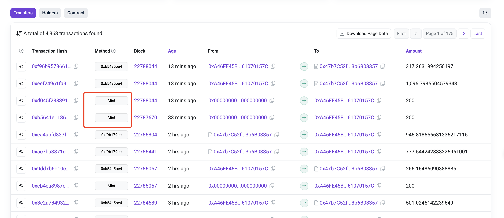
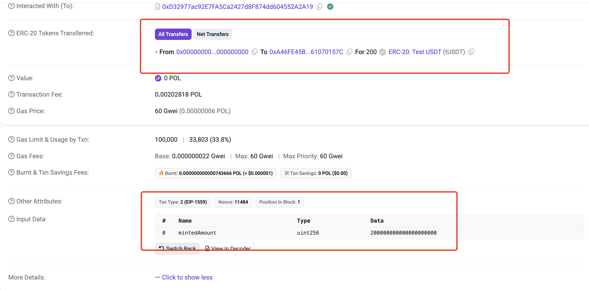
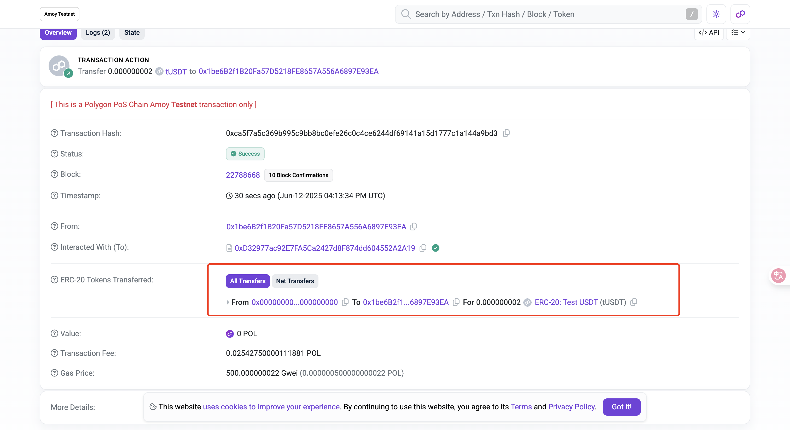

# 写合约

这一讲就是写合约了，顺便讲一讲如何看区块浏览器

# 区块浏览器

首先那我们在区块随机找一个 token 地址，可以看到他这里并没有开源。那我们如何去交互那？

0xD32977ac92E7FA5Ca2427d8F874dd604552A2A19

https://amoy.polygonscan.com/token/0xd32977ac92e7fa5ca2427d8f874dd604552a2a19

从区块浏览器的交易记录上可以看到有一个 mint 的方法被调用。


直接点进去他的 mint 交易看看,可以看到这个函数是有一个参数的 mint(uint256 mintedAmount)


我们自己尝试一下，为这个函数写一个 ABI。
`function mint(uint256 mintedAmount) public`

然后尝试交互一下合约看一看能不能成功

注意交互合约三要素：合约地址 合约 ABI Client

根据需求选择，特定的函数与参数就行了

```ts
const TUSDT_ABI = parseAbi(["function mint(uint256 mintedAmount) public"]);
const TUSDT_ADDRESS = "0xD32977ac92E7FA5Ca2427d8F874dd604552A2A19";
const main = async () => {
  // 使用walletClient进行写函数的调用，这里也可以像03节讲的一样，使用getContract先获取合约实例
  const hash = await polygonAmoyWalletClient.writeContract({
    address: TUSDT_ADDRESS,
    abi: TUSDT_ABI,
    functionName: "mint",
    args: [2000000000n],
  });
  console.log("hash:", hash); //https://amoy.polygonscan.com/tx/0xca5f7a5c369b995c9bb8bc0efe26c0c4ce6244df69141a15d1777c1a144a9bd3
  const receipt = await polygonAmoyPublicClient.waitForTransactionReceipt({
    hash,
  });
  console.log("receipt:", receipt);
};
main().catch((err) => console.error(err));
```

可以看到我们交互成功，即使他的代码没有开源。


# 总结

这一讲就讲完了，学习写合约比较重要，但是学习看区块浏览器同样也和重要。这一讲涉及啦简单的区块浏览器的查看。

你可以想一下，如果有人开发了一个 NFT 交易市场，但是合约没有开源，那不用代码的人都只能在前端页面上进行点点点的交互。你却可以通过自己在浏览器查看 其合约涉及的交易读取： 函数名称或者说函数签名 以及 涉及的合约事件。推断函数的作用，以及 ABI 格式。直接编写脚本进行交互，buy 和 sell 函数，你的 NFT 就可以比别人买的快 卖的快。你甚至可以自己写一个合约直接交互他的市场合约，函数里直接塞入 buy 和 sell 上架两个操作，04-tx 讲过区块链的交易是具有原子性的，那你的这个函数就可以达到：buy NFT 立即上架 sell NFT，任意一步失败交易就会回滚，buy 和 sell 都不会成功。那如果这个 NFT 比较火热，那你的 NFT sell 上架之后就会理解被买走。
