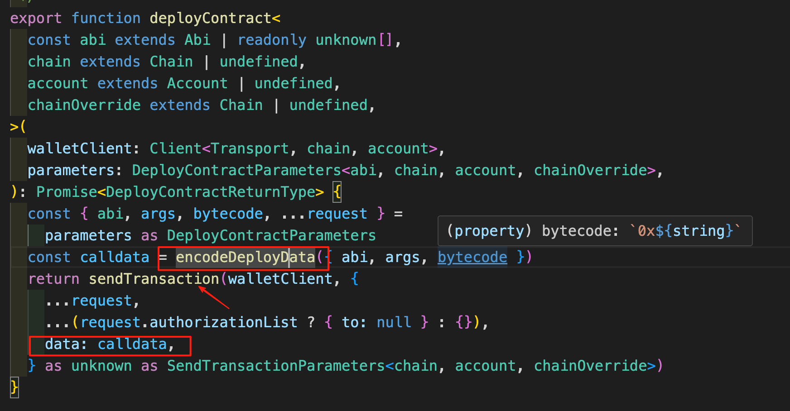
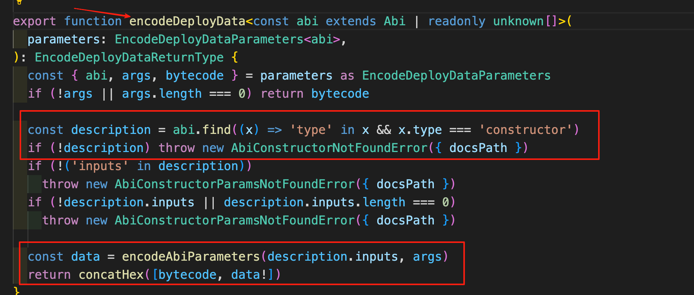

# 部署合约

写操作都是要 gas 的，现在领取测试币都是要主网有 ETH 余额，也就 polygon 好领取。这里继续使用 polygon 吧。

# tx

根据上一讲，部署合约的交易其实就是把 data 换成合约的字节码，to 就是 null `（  to?: Address | null | undefined;）`，因为在部署合约时，交易的目的是为了在区块链上创建一个新的合约，产生合约标识地址。而不是把合约部署在特定地址上。
那就有了这种简单的结构：

```ts
{
 from: singer,
 to:null | 0x,
 data: Contract BytesCode + ConstructorBytes
}
```

# 实操 使用两种方式

# 第一种 Viem deployContract Action

部署还是比较简单的，viem 有 action。直接使用 action 就可以了。这个方法那是需要 abi bytecode args(构造函数参数)。
下边会从源码里看一下，viem 到底做了什么

```ts
const abiERC20 = parseAbi([
  "constructor(string name_, string symbol_)",
  "function name() view returns (string)",
  "function symbol() view returns (string)",
  "function totalSupply() view returns (uint256)",
  "function balanceOf(address) view returns (uint)",
  "function transfer(address to, uint256 amount) external returns (bool)",
  "function mint(uint amount) external",
]);
async function deployContract() {
  const hash = await polygonAmoyWalletClient.deployContract({
    abi: abiERC20,
    bytecode: bytecodeERC20,
    args: ["PangPang", "PangPang"],
  });
  console.log(hash);
}
```

## deployContract 源码

从源码里可以看到 viem 其实也是使用 sendTransaction 发送了一笔交易，核心就在于这里的 calldata

继续往下看 这里使用了一个`encodeAbiParameters`action ，这个可以在官方文档中查看，你也可以当成生成 calldata 的函数。像 encodeFunctionData 一样


```ts
// 这里其实就是去掉0x
export function concatHex(values: readonly Hex[]): Hex {
  return `0x${(values as Hex[]).reduce(
    (acc, x) => acc + x.replace("0x", ""),
    ""
  )}`;
}
```

# 第二种：使用 sendTransaction

根据上边的源码，我们自己写一个 tx，发送给 rpc。唯一需要注意的就是 calldata

```ts
async function deployContract2() {
  const constructorAbi = parseAbi([
    "constructor(string name_, string symbol_)",
  ]);
  //   拿到abi中属于构造函数的input类型
  const description = constructorAbi.find(
    (x) => "type" in x && x.type === "constructor"
  );
  // 也可以直接自己写 不使用find 因为自己明确知道这里的类型
  //   const constructorBytes = encodeAbiParameters(
  //     [
  //       { type: "string", name: "name_" },
  //       { type: "string", name: "symbol_" },
  //     ],
  //     ["pangpang", "PP"]
  //   );

  // 构造函数参数calldata
  const constructorBytes = encodeAbiParameters(description!.inputs, [
    "pangpang",
    "PP",
  ]);

  // 因为合约有构造函数 在这里拼接一下 去掉constructorBytes的0x
  const fullBytes = (bytecodeERC20 +
    constructorBytes.slice(2)) as `0x${string}`;
  const tx: TransactionRequest = {
    to: null,
    data: fullBytes,
  };
  //   发送交易
  const hash = await polygonAmoyWalletClient.sendTransaction(tx);
  // 拿到合约地址 继续用03讲一样的代码进行测试 0xDb48f683c980823858fc22ed49a6E1E4c323a401
  console.log(hash);
}
```
