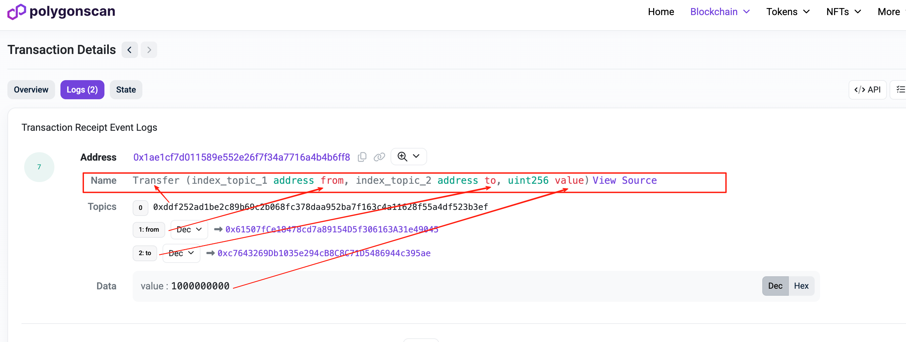

# Event

## 存储成本问题

其实对于刚入行的朋友来说，一般都会有个疑问。有了区块链是不是不需要后端了？

其实不是，因为区块链上的存储也是要消耗资源的，像 evm 的 solidity 合约 每一个占用 storage 的变量都是要消耗 gas 的，也就是说每一个 SSTORE 操作都需要 gas。简单来说，区块链数据的存储都需要烧钱。

那 evm 就有一个低成本的存储方式或者说数据记录方式就是 Event。一些数据会通过 emit 一个 Event 对外部进行信息的释放。然后后端通过捕获这些 Event 就可以在本地进行存储，就避免了因为需要操作大量的区块链 Storage 产生的存储成本问题。

下边看一下 Event 的具体表现：

- 合约中的体现
  ```solidity
  <!-- 声明event类型 有 indexed 的参数就为索引参数 -->
  event Transfer(address indexed from, address indexed to, uint256 amount);
  <!-- 发出event -->
  emit Transfer(from, to, amount);
  ```
- 区块浏览器中的体现
  https://amoy.polygonscan.com/tx/0x4f622c11592f4a3abeb335578eed63e74bc9ababa164bfccf66f6eefb037b17d#eventlog

  

# event Topic

Topic 其实就是在区块链上的索引结构，每一个 event 都会有一个基础的 Topic0 （事件签名）
`topic0 = keccak256("Transfer(address,address,uint256)")= 0xddf252ad1be2c89b69c2b068fc378daa952ba7f163c4a11628f55a4df523b3ef`

solidity 中规定一个事件最多有 3 个索引参数，每一个索引(indexed)的参数都会有 topic，那一个 event 在区块链浏览器的显示其实就是 0-4 个 Topic

```
Event Log:
├── address: 合约地址
├── topics: [topic0, topic1, topic2, topic3]
│   ├── topic0: 事件签名哈希
│   ├── topic1: 第一个 indexed 参数
│   ├── topic2: 第二个 indexed 参数
│   └── topic3: 第三个 indexed 参数
└── data: 非索引参数的 ABI 编码
```

topic 作用其实就是索引，便于快速筛选、查询和过滤事件信息。代码实操中会演示

# 实操

对于事件的处理，只有两种就是 监听 和 查询(过滤)

## 过滤器相关方法

### 创建过滤器

- `createEventFilter` - 创建事件过滤器
- `createBlockFilter` - 创建区块过滤器
- `createPendingTransactionFilter` - 创建待处理交易过滤器

### 获取过滤器结果

- `getFilterLogs` - 获取过滤器的所有日志
- `getFilterChanges` - 获取过滤器的变化
- `uninstallFilter` - 卸载过滤器

### 直接查询方法

- `getLogs` - 直接查询日志
- `getContractEvents` - 查询合约事件

### 监听方法

- `watchEvent` - 监听事件
- `watchContractEvent` - 监听合约事件
- `watchBlockNumber` - 监听新区块
- `watchBlocks` - 监听区块变化

**带 Contract 的方法**：

- `watchContractEvent` / `getContractEvents`
- 需要提供完整的 ABI
- 自动解析事件参数，提供类型安全
- 使用简单，适合已知合约

**不带 Contract 的方法**：

- `watchEvent` / `getLogs`
- 只需要事件签名，更底层
- 返回原始数据，需要手动解析
- 更灵活，可以处理未知合约或复杂查询

### 具体对比

| 方法                 | 类型安全 | 灵活性 | 解析 | 适用场景              |
| -------------------- | -------- | ------ | ---- | --------------------- |
| `watchContractEvent` | ✅ 高    | ❌ 低  | 自动 | 监听已知合约特定事件  |
| `watchEvent`         | ❌ 低    | ✅ 高  | 手动 | 监听多合约/未知事件   |
| `getContractEvents`  | ✅ 高    | ❌ 低  | 自动 | 查询已知合约历史事件  |
| `getLogs`            | ❌ 低    | ✅ 高  | 手动 | 复杂过滤/原始日志查询 |

# 监听

因为需要交易频繁的合约，这里直接使用主网的 USDT

# 查询

# 过滤

# 方案

在上边的这些 actions 中都存在点问题：

- http 轮询，这里利用轮询，是会有延迟的
  ```ts
  <!-- 默认的poll时间间隔 -->
  const defaultPollingInterval = Math.min(
    Math.max(Math.floor(blockTime / 2), 500),
    4_000
  );
  ```
- wss，可能由于连接不稳定会出现遗漏的问题

## 监听区块

怎么弥补这里的缺点那？

我不是后端，具体后端的最佳实践是什么还是要问后端大佬。当然我也看过一些 ts 的后端代码，采用的方案是混合的，监听作为获取数据的方式，通过过滤区块 和 事件作为一种重新初始化完整数据的一种方式。过滤只有在监听出问题的时候才会执行一个这个函数。

这里有我一个个人的想法，因为三明治攻击就是监听区块 然后处理 pending 交易是否完成 或者 过时。

一般来说监听区块的产生是不会出现遗漏区块的，那监听区块，然后通过区块查询相关的事件数据。是不是可以实现稳定和实时了那？

```ts
const unWatch = wssPublicClient.watchBlockNumber({
  onBlockNumber: async (blockNumber) => {
    // 监听到新的区块产生，就查询下新的区块里的数据
    const logs = await wssPublicClient.getLogs({
      fromBlock: blockNumber,
      toBlock: blockNumber,
      address: USDT_ADDRESS,
      event: parseAbiItem(
        "event Transfer(address indexed from, address indexed to, uint256)"
      ),
    });
    console.log(logs);
    // 直接处理相关事件
  },
});
```
