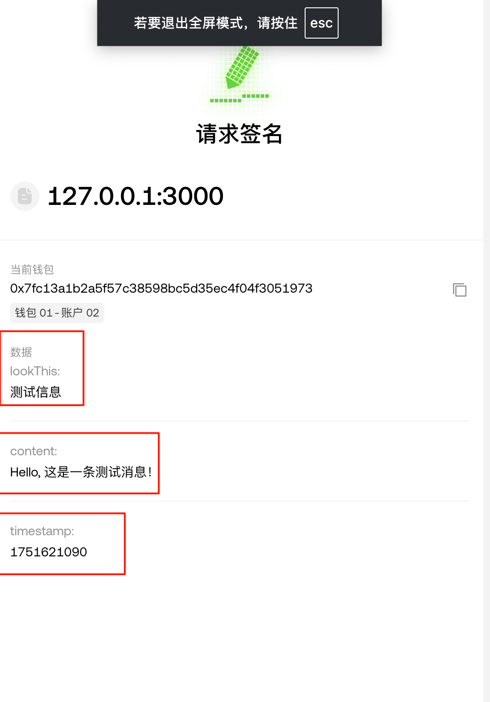

EIP-712 (Ethereum Improvement Proposal 712) 是以太坊的一个重要标准，用于结构化数据的哈希和签名。它主要解决了以太坊早期签名方式的一些问题。

https://eips.ethereum.org/EIPS/eip-712

https://learnblockchain.cn/article/13781

总结一下：

传统签名显示的是 bytes

EIP712 可以显示出结构化的数据

传统和 EIP712 都可以通过特定的方式 解析出 singer 签名者是谁

在 eip712.html 中测试一下签名


在 eip712.ts 里是 viem 的签名和验证

https://viem.sh/docs/accounts/local/toAccount#signtypeddata

```solidity
contract MyContract {
    // 合约内置的 Domain 信息
    string public constant NAME = "MyDApp";
    string public constant VERSION = "1";
    bytes32 private DOMAIN_SEPARATOR;

    constructor() {
        DOMAIN_SEPARATOR = keccak256(
            abi.encode(
                keccak256("EIP712Domain(string name,string version,uint256 chainId,address verifyingContract)"),
                keccak256(bytes(NAME)),
                keccak256(bytes(VERSION)),
                block.chainid,
                address(this)  // 👈 合约自己的地址
            )
        );
    }
}
```
